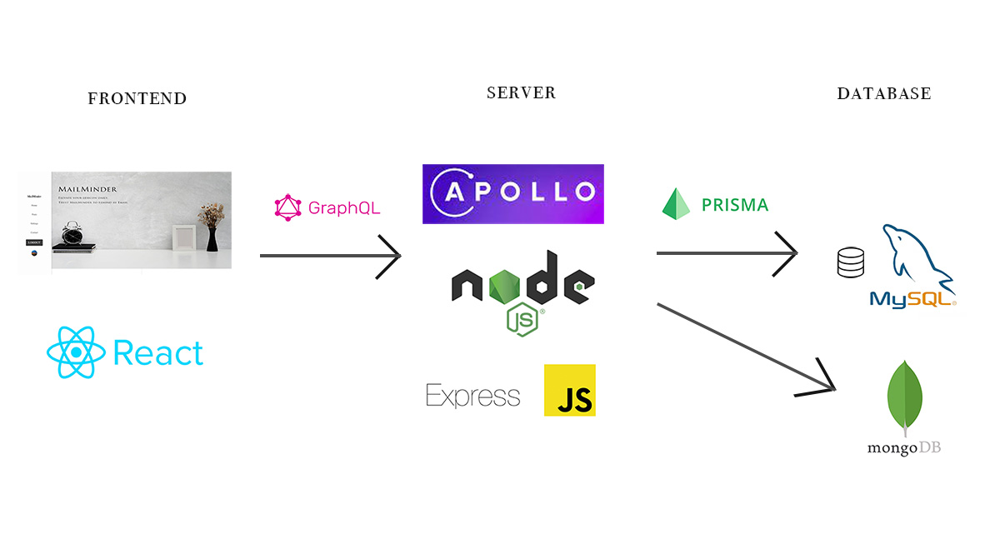
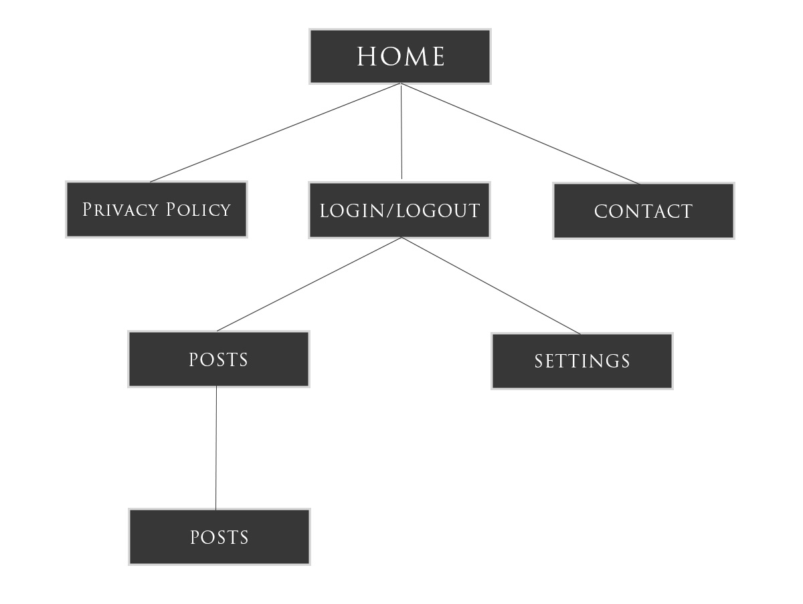

# Email Reminder Full Stack Application

<!-- Image -->

[Website](https://remindapp.onrender.com/)

This project is built using React (Vite) and Node.js (Express) with Prisma ORM and MySQL. 
It is a full-stack application that allows users to register their vocabulary and review them by sending an email reminder. 
Users can also upload images to Cloudinary and register them to their vocabulary cards. 
The application is deployed on Render.com. Fully responsive design, mobile friendly.

## Features
- User Authentication (Register, Login, Logout)
- User can add, edit, delete and review their own vocabulary cards (CRUD)
- User can be reminded by email to review their cards at 10 AM every day
- User can see the random 5 cards in the Email from the list of their own vocabulary cards 
- Forms are validated by react-hook-form and zod (Frontend)
- Forms are validated by Joi (Backend)
- User login data is stored in MySQL (Prisma ORM)
- User login credentials are securely stored in HTTPOnly cookie to handle global state
- User can upload image to Cloudinary and register it to the vocabulary card 
- Uploaded image is compressed by sharp when it is uploaded
- User can search Google for image path and register it to the vocabulary card
- Contact form is available to send email to the developer
- Dark mode switch is available

<!-- Image -->
## Architecture


<!-- Image -->
## Sitemap



## Prerequisites
Before running this project, make sure you have Node.js installed on your system.

## Installation

To get started with the Anime API & Firebase project, run the following commands:

   ### Backend

```bash
      npm install (root directory) 
```

prisma/schema.prisma automatically creates generated folder

```bash
      npx prisma generate (generate neccecery folders for deployment)
```

```bash
      npm run dev
```

   ### Frontend

```bash
    cd frontend (move to frontend directory)
    npm install
    npm run dev
```


# Deploy
   You might need to delete all files in prisma folder except schema.prisma and run the following command
```bash
   npx prisma generate 
```


## Languages & tools Frontend
- [React](https://reactjs.org/)
- [Vite](https://vitejs.dev/)
- [TypeScript](https://www.typescriptlang.org/)
- [React Router](https://reactrouter.com/)
- [React Hook Form](https://react-hook-form.com/)
- [Zod]
- [Apollo Client](https://www.apollographql.com/docs/react/)
- [GraphQL](https://graphql.org/)
- [React Bootstrap](https://react-bootstrap.github.io/)
- [Emotion](https://emotion.sh/docs/introduction)
- [EmailJS](https://www.emailjs.com/)
- [React Toastify](https://fkhadra.github.io/react-toastify/introduction)
- [React PWA](https://www.npmjs.com/package/vite-plugin-pwa) Only with Internet

## Languages & tools Backend
- [GraphQL](https://graphql.org/)
- [Node.js](https://nodejs.org/)
- [Express](https://expressjs.com/)
- [Prisma](https://www.prisma.io/)
- [MySQL](https://www.mysql.com/)
- [Nodemailer](https://nodemailer.com/about/)
- [Cloudinary](https://cloudinary.com/)
- [Sharp](https://sharp.pixelplumbing.com/)
- [Joi](https://joi.dev/)
- [Node Cron](https://www.npmjs.com/package/node-cron)
- [JWT](https://jwt.io/)
- [Bcrypt](https://www.npmjs.com/package/bcrypt)
- [Cors](https://www.npmjs.com/package/cors)
- [Dotenv](https://www.npmjs.com/package/dotenv)
- [Colors](https://www.npmjs.com/package/colors)
- [Concurrently](https://www.npmjs.com/package/concurrently)
- [Nodemon](https://www.npmjs.com/package/nodemon)

## DB
- MySQL (Prisma ORM)

# Before Deployment in main.tsx (frontend)
   * Change the uploadLink variable
   
      uri: 'http://localhost:5001'

      to

      uri: 'https://remindapp.onrender.com/' 
      
      so that server can connect to render.com


## In order to use ES modules, 
we need to add "type": "module" in package.json
 Ok  ->  EX: import express from "express";　
 bad -> const express=require("express"); 

## License
   This project is licensed under the MIT license.

## Contributing
   Please feel free to contact me. See my email and GitHub username below.

### Created by 
   KZ-Dev 2023

## installed npm packages

   ### Front-end
     <!-- * npm install normalize.css (reset css) -->
     * npm install @apollo/client graphql  
     * npm i react-bootstrap bootstrap
     * npm i react-icons
     * npm i react-router-dom
     * npm i @emotion/styled

     <!-- * npm install jsonwebtoken  
     * npm i --save-dev @types/jsonwebtoken -->

     * npm i @emotion/react
     
      In tsconfig.json ↓↓↓

         "compilerOptions": {
         "jsx": "react-jsx",
         "jsxImportSource": "@emotion/react",
         }

      ## Proxy setting (REST API)
         ### "proxy": "http://localhost:5001" in package.json (frontend)
         ### This is for development only, therefore, good for production deployment.

         ###  proxy: {'/api': 'http://localhost:5001', // プロキシの設定(バックエンドのポート番号) }, in vite.config.ts
         

      * npm i apollo-upload-client

      * npm i --save react-helmet

      * npm i --save @types/react-helmet (if you use typescript)

      * npm i zod

      * npm i react-hook-form

      * npm i @hookform/resolvers

      * npm i @emailjs/browser

      * npm i dotenv (To access to .env file which is above the frontend directory) 

      ### pwa for VITE
         npm install vite-plugin-pwa


   ### Back-end
      ### concurrently
      - npm install concurrently --save-dev

      ### nodemon
      - npm install nodemon --save-dev

      ### express
      - npm install express

      ### dotenv
      - npm install -D dotenv
      - import dotenv from 'dotenv';
      - dotenv.config();

      ### colors.js (This is for console.log color)
      - npm install colors --save-dev

      ### bcryptjs
      - npm install bcryptjs
         To use: bcrypt.hashSync(password, 10); // 10 is salt

      ### cors
      - npm install cors

      ### jsonwebtoken
      - npm install jsonwebtoken

      ### multer
      - npm install multer

      ### express
      - npm install express

      ### graphql-upload
      - npm install graphql-upload

      ### apollo-upload-client (for image upload?)
      npm install apollo-upload-client

      graphql-tools (deprecated)

      ### node mailer
        - npm install nodemailer

      ### node-cron
         - npm install node-cron
      
      ### swap to StandAlone to express server (for Deployment)
      
         npm install express cors body-parser

      ### joi validation
         npm install joi

      ### cookie-parser
         npm install cookie-parser

      ### cloudinary
         npm install cloudinary 

      ### sharp (image compressor)
         npm install sharp

      
         

# PRISMA SETUP
Open Prisma Studio -->  http://localhost:5555/
   npx prisma studio

<!-- 一番初め -->
npm init    

npm i @apollo/server

npm i graphql-tag


npm install concurrently --save-dev

npm i colors

 
<!-- Repo から Clone してきた場合これをしないと run dev できない -->
npx prisma init

<!-- Migrate to MySQL DB -->
npx prisma migrate dev --name init 
or 
<!-- 何か schema.prismaを変更の度に実行しないといけない -->
npx prisma db push


<!-- Generate Prisma Client -->
npm i @prisma/client

<!-- Hash password -->
npm i bcryptjs

<!-- トークン -->
npm i jsonwebtoken

npm i dotenv


<!-- npm i apollo-server-express (Deprecated) -->

npm i graphql-ws @graphql-tools/schema

npm i express


